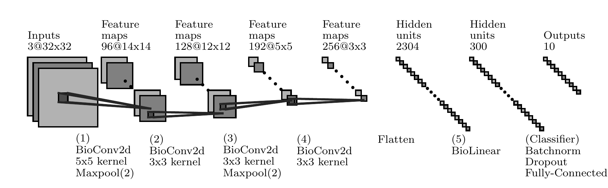

# BioPyTorch
PyTorch implementation of the learning rule proposed in "Unsupervised learning by competing hidden units", D. Krotov, J. J. Hopfield, 2019, https://www.pnas.org/content/116/16/7723

## Installation
Install with `pip`:
```shell
pip install biopytorch
```

## Usage
The package provides two layers, `BioLinear` and `BioConv2d`, that respectively mirror the features of `nn.Linear` and `nn.Conv2d` from PyTorch, with the added support of training with the alternative rule proposed by Krotov & Hopfield. 

They share all the same parameters of their analogues (except for `BioConv2d`, which currently does not support the use of `bias`). To execute a single update step, call the method `training_step`. 

See the example notebook in `notebooks` for more details. 

## Other files
- `dev/bioconv2d_dev.py` contains an alternative implementation of `BioConv2d` using `F.unfold`. The performance is significantly worse (especially for memory), so it should not be used in practice. However, the algorithm is easier to follow, and can be used to get a better understanding of the Krotov learning rule.
- `slides` contains a few explanatory slides
- `notebooks`: examples

## Benchmark 

Hyperparameters (p, k, Delta - for their meaning, see the `slides`, or the docstrings) are optimized with respect to the validation accuracy of classification on the CIFAR-10 dataset, using the `Optuna` library. 

Specifically, the architecture (taken from [2]) is as follows:


The `(Classifier)` segment is inserted in different positions - after `(1)`, `(2)`, ... - such that the change in performance given by deeper layers may be measured.

Depending on the number of hebbian layers preceding the `(Classifier)`, the performance obtained with the best hyperparameters found is as follows:

|     #layers     |     1 |     2 |     3 |     4 |      5 |
|:---------------:|------:|------:|------:|------:|-------:|
|  Accuracy (val) | 66.97 | 65.44 | 63.87 | 58.79 |  45.91 |
| Accuracy (test) | 66.21 | 65.22 | 63.08 | 58.86 |  45.45 |
|       p       |     2 |     8 |     8 |     8 |      8 |
|       k       |     9 |     3 |     5 |     7 |      2 |
|     Delta    |   .08 |   .34 |   .25 |  .235 |   .335 |
|     Dropout     |    .2 |   .25 |   .05 |    .1 |     .1 |
|      Params     |  195k |  302k |  387k |  804k | 1.475M |

p, k and Delta are the same for all the `BioConv2d` layers.
When the full architecture is trained, different hyperparameters are used for the BioLinear layer. However, for the best run, they are exactly equal to the ones already used for the previous `BioConv2d`, which are reported in the table.

Note that performance is slightly better than the results obtained in [2], here reported for reference:

|     #layers     |     1 |     2 |     3 |     4 |      5 |
|:---------------:|------:|------:|------:|------:|-------:|
|  Accuracy (this) | 66.21 | 65.22 | 63.08 | 58.86 |  45.45 |
| Accuracy ([2]) | 63.92 | 63.81 | 58.28 | 52.99 |  41.78 |

**Note**: optimization was done using `experiments/03_bioarchitecture_cifar10.py`. A full report on the trials is available on [wandb](https://wandb.ai/francesco-manzali/bioarchitectures-cifar10/reports/Bio-Architectures--Vmlldzo5NTE2NzQ).

## Sources
[1] Krotov, Hopfield, "Unsupervised learning by competing hidden units", 2019

[2] Amato et al., "Hebbian Learning Meets Deep Convolutional Neural Networks", 2019


